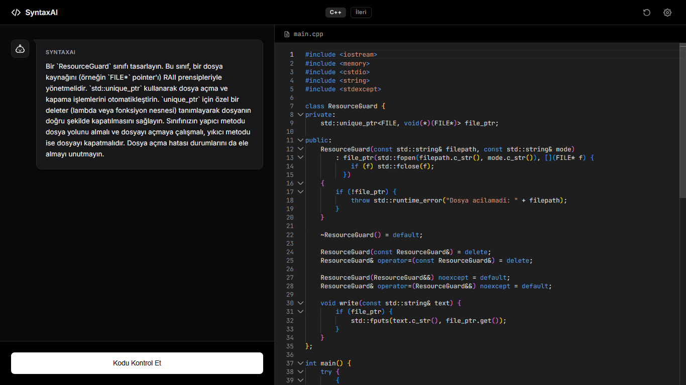

<div align="center">
  
  
  <h1>SyntaxAI</h1>
  <p>Modern ve şık bir tasarıma sahip, yapay zeka destekli interaktif kodlama eğitmeni ve IDE.</p>

  <div>
    
    
    
    
  </div>
</div>

---

## 🌟 Özellikler

- **Modern & Premium Arayüz**: Vercel ve Linear gibi üst düzey geliştirici araçlarından ilham alan şık bir karanlık mod (Dark Mode) tasarımı.
- **Akıllı Yapay Zeka Eğitmeni**: Google Gemini (ayrıca OpenAI ve Anthropic) tarafından desteklenir. Yapay zeka, seçtiğiniz zorluk seviyesine (Başlangıç, Orta, İleri) göre ipuçlarını dinamik olarak ayarlar.
- **Dile Özel Gelişim Takibi**: Kodunuzu kaybetmeden diller arasında geçiş yapabilirsiniz. SyntaxAI her dil için ayrı ayrı kodunuzu, görevinizi ve geri bildirimleri hafızasında tutar.
- **VS Code Benzeri Editör Deneyimi**: Entegre Monaco Editör sayesinde:
  - Dinamik Emmet desteği (`.sinifadi`, `#idadi`, `!`)
  - Otomatik kapanan etiketler ve parantezler
  - Java, C++, C#, Python, Rust ve Go dilleri için otomatik iskelet (boilerplate) kod oluşturma desteği.
- **Kesintisiz Deneyim (API Key Rotasyonu & Model Fallback)**: Birden fazla API anahtarı ekleyebilirsiniz. Eğer bir anahtar veya seçilen model kota sınırına takılırsa (Quota Exceeded / 429), sunucu otomatik olarak sıradaki anahtara veya daha uygun bir modele (Fallback) geçiş yaparak kesintisiz eğitim sağlar.
- **Akıllı Kota Tasarrufu**: Eğer kodda hiçbir değişiklik yapılmadıysa gereksiz API çağrılarını engelleyerek API kotalarınızı korur.

## 🚀 Başlarken

### 1. Gereksinimler
- [Node.js](https://nodejs.org/) (v16 veya üzeri)
- NPM veya Yarn

### 2. Kurulum

Projeyi bilgisayarınıza klonlayın ve bağımlılıkları yükleyin:

```bash
git clone https://github.com/kullaniciadiniz/SyntaxAI.git
cd SyntaxAI
npm install
```

### 3. Çevre Değişkenleri (Environment) Ayarları

`.env.example` dosyasının adını `.env` olarak değiştirin (veya yeni bir `.env` dosyası oluşturun) ve API anahtarlarınızı ekleyin. Otomatik rotasyon için birden fazla anahtar ekleyebilirsiniz:

```env
GEMINI_API_KEY_1=birinci_gemini_anahtariniz
GEMINI_API_KEY_2=ikinci_gemini_anahtariniz
# İsteğe Bağlı:
# OPENAI_API_KEY=
# ANTHROPIC_API_KEY=
```

### 4. Uygulamayı Başlatma

Geliştirme sunucusunu çalıştırın:

```bash
npm run dev
```

Tarayıcınızı açın ve `http://localhost:3000` adresine gidin.

## 🧠 Desteklenen Diller
JavaScript, Node.js, React, TypeScript, Python, HTML, CSS, Java, C++, C#, Go ve Rust.

## 🤝 Katkıda Bulunma
Katkılarınız, geri bildirimleriniz ve özellik talepleriniz bizim için değerlidir. Geliştirmeler için [issues (sorunlar) sayfasını](https://github.com/kullaniciadiniz/SyntaxAI/issues) ziyaret edebilirsiniz.

## 📄 Lisans
Bu proje [MIT](LICENSE) lisansı altında sunulmaktadır.
